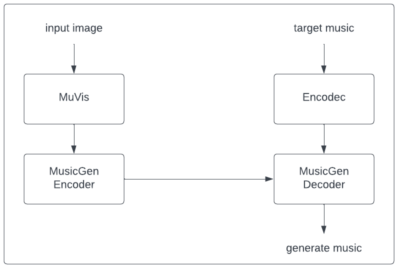

# Imagic

## Introduction

A transformer-based solution is approached in the architecture design of Imagic, with support from the proven music generation model - MusicGen. MusIm has performed well in the music-conditioned image generation task such that it has achieved good scores of KLD and FAD The architecture is shown below:



## Usage

```python
from transformers import AutoImageProcessor, AutoModel

vit_proc = AutoImageProcessor.from_pretrained("google/vit-base-patch16-224-in21k", low_cpu_mem_usage=True)

i2m = AutoModel.from_pretrained("juliagsy/imagic", trust_remote_code=True)
i2m.model.load_state_dict(torch.load("imagic_state_dict.bin"))
```

## Image-conditioned Music Generation

### Generation

```python
from IPython.display import Audio
from IPython.core.display import display

input_img = "<your-image>"

img = vit_proc(input_img, do_rescale=False, return_tensors="pt")
img = img.to("cuda")

i2m.to("cuda")
gen_wav = i2m.generate(img, guidance_scale=3)
sampling_rate = i2m.model.musicgen.config.audio_encoder.sampling_rate
display(Audio(gen_wav[0].cpu().numpy(), rate=sampling_rate))
```

### Example

Example image:


[Output wav](examples/wav_5.wav)

